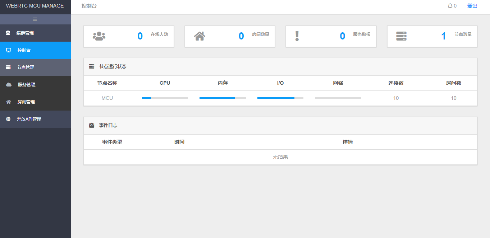
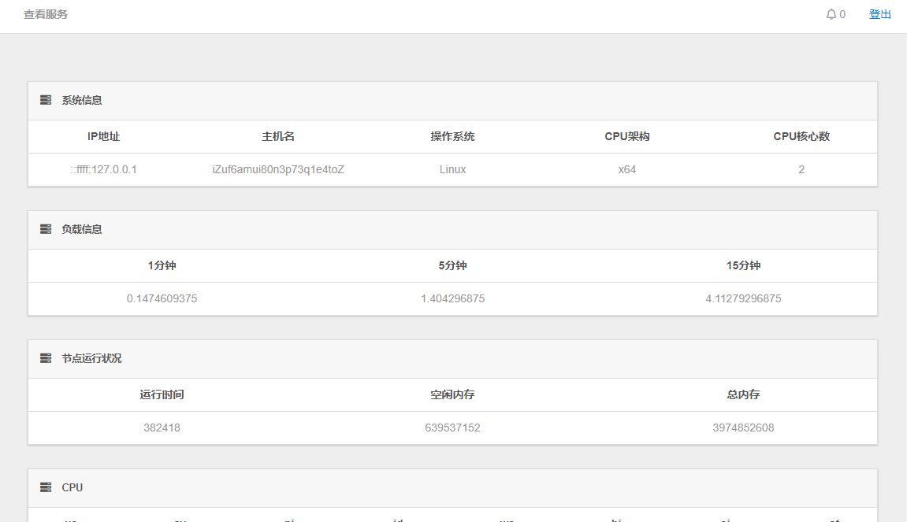

Create high-performance, reliable, and scalable real-time communication solutions. Server and client tools to deliver RTC experiences with video conferencing capabilities. Optimized for Intel® Architecture to take full advantage of Intel hardware-acceleration with H.264 and HEVC encode/decode.


## Version

* ``0.0.1 Nightly Build.``


## About

* This service need **Node.JS®**.
* The service can be run independently, **Intel WebRTC MCU®** needs to connect to this service, managed by this service.
* This service provides a remote call API.
* This service requires runtime injection of **Intel WebRTC MCU®**.
* Use **WebSocket** to send system information between nodes and centers.
* Tasks are passed between nodes and centers through **RabbitMQ®**


## You need to

``You need to have the following dependencies ready.``

#### System environment

* [MongoDB](https://www.mongodb.com/) **(>= 3.6.x)** MongoDB is a document database with the scalability and flexibility that you want with the querying and indexing that you need.
* [Redis](https://redis.io/) **(>= 4.x)** Redis is an open source (BSD licensed), in-memory data structure store, used as a database, cache and message broker.
* [Node.JS](https://nodejs.org) **(>= 10.x)** Node.js® is a JavaScript runtime built on Chrome's V8 JavaScript engine.
* [PostgreSQL](https://www.postgresql.org/)  **(>= 10.x)** PostgreSQL is a powerful, open source object-relational database system with over 30 years of active development that has earned it a strong reputation for reliability.
* [RabbitMQ](http://www.rabbitmq.com/) **(>= 3.7.x)** RabbitMQ is the most widely deployed open source message broker.

#### NPM module dependencies

* [axios](https://github.com/axios/axios) Promise based HTTP client for the browser and node.js.
* [body-parser](https://github.com/expressjs/body-parser) Node.js body parsing middleware.
* [cookie-parser](https://github.com/expressjs/cookie-parser) Parse HTTP request cookies.
* [cookie-session](https://github.com/expressjs/cookie-session) Simple cookie-based session middleware.
* [ejs](https://github.com/tj/ejs) Embedded JavaScript templates for node.
* [express](https://github.com/expressjs/express) Fast, unopinionated, minimalist web framework for node.
* [mongodb](https://github.com/mongodb/node-mongodb-native) Mongo DB Native NodeJS Driver.
* [nodemailer](https://github.com/nodemailer/nodemailer) Send e-mails with Node.JS.
* [redis](https://github.com/NodeRedis/node_redis) redis client for node.
* [toml](https://github.com/BinaryMuse/toml-node) TOML parser for Node.js and the Browser. Parses TOML v0.4.0.
* [ws](https://github.com/websockets/ws) Simple to use, blazing fast and thoroughly tested WebSocket client and server for Node.js.
* [uuid](https://github.com/kelektiv/node-uuid) Generate RFC-compliant UUIDs in JavaScript.
* [http-proxy](https://github.com/nodejitsu/node-http-proxy) A full-featured http proxy for node.js.
* [amqplib](https://github.com/squaremo/amqp.node) AMQP 0-9-1 library and client for Node.JS.
* [moment](https://github.com/moment/moment) Parse, validate, manipulate, and display dates in javascript.
* [decimal.js](https://github.com/MikeMcl/decimal.js) An arbitrary-precision Decimal type for JavaScript.
* [pg-promise](https://github.com/vitaly-t/pg-promise) Promises/A+ interface for PostgreSQL.
* [chalk](https://github.com/chalk/chalk) Terminal string styling done right.


## Debug

```console
      
          ┌─┐       ┌─┐
       ┌──┘ ┴───────┘ ┴──┐
       │                 │
       │       ───       │
       │  ─┬┘       └┬─  │
       │                 │
       │       ─┴─       │
       │                 │
       └───┐         ┌───┘
           │         │
           │         │
           │         │
           │         └──────────────┐
           │                        │
           │                        ├─┐
           │                        ┌─┘    
           │                        │
           └─┐  ┐  ┌───────┬──┐  ┌──┘         
             │ ─┤ ─┤       │ ─┤ ─┤         
             └──┴──┘       └──┴──┘ 
             
               CNM Bless 
             Code Not BUG! 

```


## Install

You neead install npm package.

```console
~ npm install
```

You need to create a new configuration file.

```console
~ vim ./configure.toml
```

```console
# http configure
[http]
# you web host
host = "localhost"
# you need listen port
port = 80
# http origin
origin = "http://localhost"
# html view files
views = "./page/html"
# html static public files
public = "./page/public"

# http session configure
[session]
name = ""
maxAge = 0
keys = []

# mongodb configure
[mongodb]
host = "127.0.0.1"
port = 27017
dbname = "console"
document = [
  "admin",
  "log",
  "system",
  "cluster"
]

# mongodb auth configure
# !when you need to fill in the certification
[mongodb.auth]
user = ""
password = ""

# redis configure
[redis]
host = "127.0.0.1"
port = 6379
password = ""

# crypto configure
[crypto]
type = "aes256"
key = ""

# email service configure
[nodemailer]
service = "smtp.qq.com"
host = "smtp.qq.com"
port = 465
secureConnection = true
secure = true

# email service auth configure
[nodemailer.auth]
user = ""
pass = ""

# intel webrtc mcu listen configure
[service]
port = 88
router = "/masterApi"

# log configure
[log]
path = "./mcu.log"
```

Save this configuration file.
next.
You need to create a new default management account in the database.

```console
~ mongo
use console
db.admin.insert({ username: "root", password: "root" })
```

You can now login to this service with this newly created default admin account.
next.
Start this Service.

```console
~ node mcu.js
```

or use pm2

```console
~ pm2 start mcu.js -i auto
```

Now please start enjoying!


## Instructions for use

* Console included Brief information report for the entire service.



* Cluster node new, edit, status view.


* View server information.



* WebRTC service list view edit add.


* Rooms list view edit add.


* Room edit.


## Supplementary explanation

This service is still in the testing phase, so you must be responsible for the loss of data and other system losses caused by unknown problems.


## License

[MIT](./LICENSE)

Copyright (c) 2018 Mr.Panda.